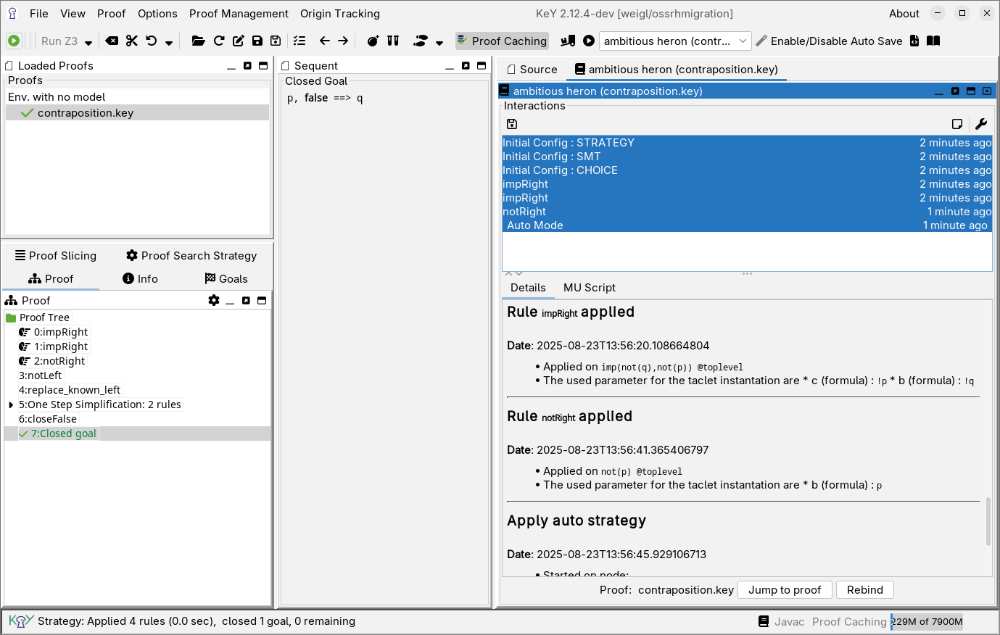

# key-interactionlog -- A Logger for User Interactions in KeY

*InteractionLog* is a plugin for the graphical user interface in KeY.
It helps you to understand your steps during the proof, to gather
statistical information and to create proof script for automating your
interactions. to achieve this, InteractionLog hooks into KeY to record
interactions triggered by the user. The recorded logbooks including
the information to redo these actions can be stored as JSON files.
Redos are not limited on the original proofs, you can open a logbook
and also apply the stored interactions on different proofs.

````

## Getting Started

### Using official releses on maven central

As a KeY developer, you can also add InteractionLog into your KeY build
as a dependency in `build.gradle`. Just add the following lines to `key.ui/build.gradle`:

```gradle 
dependencies {
  //...
  runtimeOnly("io.github.wadoon.key:key-interactionlog:1.0.0")
}
```

Current version: 

### Using SNAPSHOT version

If you prefer a SNAPSHOT version use the following setup: 
```
repositories {
    maven { url = uri("https://central.sonatype.com/repository/maven-snapshots")}
}

dependencies {
  //...
  runtimeOnly("io.github.wadoon.key:key-interactionlog:1.1.0-SNAPSHOT")
}
```

### Mnaual installation

1. Download this repository and run the following command line: 

    ```
    $ gradle :interactionlog:shadowJar
    ```

    A Jar file should be `interactionlog/build/libs/keyext.interactionlog-*all.jar`.  

2. Add this Jar file into the KeY's classpath: 

   ```
   $ export KEYJAR=key.ui-2.11.0-exe.jar
   $ export INTERLOGJAR=interactionlog-1.1.0-SNAPSHOT-all.jar
   $ java -cp $KEYJAR:$INTERLOGJAR de.uka.ilkd.key.core.Main --experimental
   ```
   
   `--experimental` currently needed, will be unnecessary if version 1.0 is reached. 
   
   Interaction Log should be automatically loaded.

Note, Interaction Log requires some API changes in KeY, which are part
of the KeY's master since January 2021. Therefore, InteractionLog is
**not** useable with KeY 2.10.0 and below.


## History

* Version: 0.9 (not finally released)  
  - The plugin was migrated to this repository to make it finally freely available.


## User Interface

... work in progress ... 


## Releasing `key-abbrevmgr`

1. Remove SNAPSHOT from version number
2. Update `README.md`
3. Create new commit and tag.
4. `gradle publishToCentral closeAndReleaseCentralStagingRepository`.
5. Create new GitHub release
6. Set version number to SNAPSHOT

